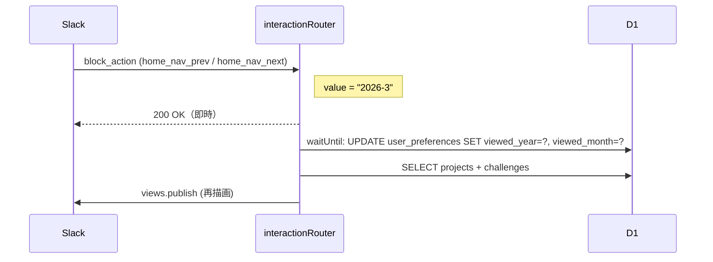

# App Home Tab 設計書

## 概要

Slack Block Kit を使用したメインダッシュボードのビュー構築設計。
`src/views/home.ts` に集約し、各セクションをコンポーネント関数として分離する。

---

## ビュー構築関数シグネチャ

```typescript
// src/views/home.ts

/** App Home 全体を構築して Slack の views.publish に渡す view オブジェクトを返す */
export function buildHomeView(
  user: UserRow,
  preferences: UserPreferencesRow,
  projects: ProjectWithChallenges[],
  displayYear: number,
  displayMonth: number,
): SlackHomeView;

// ── サブコンポーネント ──────────────────────────────────────────

function buildNavSection(
  displayYear: number,
  displayMonth: number,
  isNextMonthDisabled: boolean,
): KitBlock[];

function buildProjectSection(
  project: ProjectWithChallenges,
): KitBlock[];

function buildChallengeRow(challenge: ChallengeRow): KitBlock[];

function buildEmptyState(): KitBlock[];

function buildFooterActions(hasDraftProjects: boolean): KitBlock[];

// ── ユーティリティ ─────────────────────────────────────────────

/** viewed_year/viewed_month が NULL の場合に現在年月を補完する */
export function resolveDisplayMonth(
  preferences: UserPreferencesRow,
): { year: number; month: number };

/** year/month が現在月以降かどうか判定（次月ナビの disabled 制御用）*/
export function isCurrentOrFutureMonth(
  year: number,
  month: number,
): boolean;
```

---

## Block Kit コンポーネント階層

```
HomeView (type: "home")
├── NavSection
│   ├── section: "👋 こんにちは、{user_name}!"
│   ├── context: "{year}年{month}月のチャレンジ"
│   └── actions:
│       ├── button: "← 前月"  action_id=home_nav_prev  value="{year}-{month}"
│       └── button: "次月 →"  action_id=home_nav_next  value="{year}-{month}"
│                              ↑ 現在月以降なら disabled=true
│
├── EmptyState（projects.length === 0 の場合のみ）
│   └── section: "まだチャレンジがありません 🌱 / ＋ プロジェクト追加 から登録してみましょう！"
│
├── ProjectSection[] （project ごとに繰り返し）
│   ├── header: "{status_badge} {title}"
│   │           status_badge: 🟡 draft / 🟢 published / ✅ reviewed
│   ├── ChallengeRow[] （challenge ごとに繰り返し）
│   │   ├── section:
│   │   │   text: "{status_icon} {name}  [期日: {due_on}]"
│   │   │   accessory: overflow_menu (⋮)
│   │   │     option: "💬 コメントを追加"  action_id=challenge_open_comment  value="{challenge_id}"
│   │   └── actions（status が not_started / in_progress の場合のみ）:
│   │       ├── button: "未着手"  action_id=challenge_set_not_started  value="{challenge_id}"
│   │       ├── button: "進行中"  action_id=challenge_set_in_progress  value="{challenge_id}"
│   │       └── button: "✅済"   action_id=challenge_set_completed     value="{challenge_id}"
│   ├── actions:
│   │   ├── button: "+ チャレンジ追加"   action_id=home_open_add_challenge  value="{project_id}"
│   │   ├── button: "✏️ 編集"           action_id=home_open_edit_project   value="{project_id}"
│   │   │   ↑ status が reviewed の場合は非表示
│   │   ├── button: "🗑️ 削除"           action_id=home_confirm_delete_project value="{project_id}"
│   │   │   ↑ status が reviewed の場合は非表示
│   │   └── button: "📋 振り返りを完了する"  action_id=home_review_complete  value="{project_id}"
│   │       ↑ 全 challenge が completed/incompleted かつ status が published の場合のみ
│   └── divider
│
└── FooterActions
    ├── button: "＋ プロジェクト追加"   action_id=home_open_new_project
    ├── button: "📣 今月を宣言する"      action_id=home_publish
    │   ↑ draft project が 1件以上存在する場合のみ
    └── button: "⚙️ 設定"              action_id=home_open_settings
```

---

## Challenge ステータスアイコン

| status | アイコン | 意味 |
|--------|---------|------|
| `draft` | ⚪ | 未公開 |
| `not_started` | 🔴 | 未着手（公開済）|
| `in_progress` | 🔵 | 進行中 |
| `completed` | ✅ | 達成 |
| `incompleted` | ❌ | 未達成（確定）|

---

## 表示月の解決ロジック

```typescript
export function resolveDisplayMonth(
  preferences: UserPreferencesRow,
): { year: number; month: number } {
  const now = new Date();
  return {
    year: preferences.viewed_year ?? now.getUTCFullYear(),
    month: preferences.viewed_month ?? (now.getUTCMonth() + 1),
  };
}

export function isCurrentOrFutureMonth(year: number, month: number): boolean {
  const now = new Date();
  const cy = now.getUTCFullYear();
  const cm = now.getUTCMonth() + 1;
  return year > cy || (year === cy && month >= cm);
}
```

> `viewed_year === null && viewed_month === null` → 現在月を表示。

---

## 前月・次月ナビの処理フロー



**前月計算:**
```
prev(year, month):
  if month === 1: return { year: year - 1, month: 12 }
  else:           return { year, month: month - 1 }
```

**次月ナビの disabled 条件:**
```
isCurrentOrFutureMonth(year, month) === true → disabled
```

---

## 設定モーダル設計

**callback_id**: `modal_settings`（App Home の [⚙️ 設定] ボタンと `/cem_settings` コマンドで共用）

```
┌─────────────────────────────────────┐
│ 設定                                │
├─────────────────────────────────────┤
│ マークダウン入力モード               │
│ [OFF ○] [ON ●]                      │
│ block_id: toggle_markdown_mode      │
│                                     │
│ 個人リマインダー DM                 │
│ [OFF ○] [ON ●]                      │
│ block_id: toggle_personal_reminder  │
└─────────────────────────────────────┘
```

| block_id | action_id | 種別 |
|----------|-----------|------|
| `toggle_markdown_mode` | `toggle_markdown_mode` | radio_buttons（`true` / `false`）|
| `toggle_personal_reminder` | `toggle_personal_reminder` | radio_buttons（`true` / `false`）|

**モーダルを開く際**: 現在の preferences 値を `initial_option` にセットして現在値を表示する。

**view_submission 処理**: `PATCH /users/:slack_user_id/preferences` を呼び出して保存。App Home の再描画は不要（設定変更は即次回の `/cem_new` 等で反映される）。

---

## App Home 更新トリガー一覧

| イベント | views.publish タイミング |
|---------|------------------------|
| `app_home_opened` | waitUntil 内で即座に発火 |
| 月ナビ操作 | DB 更新後 waitUntil |
| Challenge ステータス変更 | DB 更新後 waitUntil |
| モーダル送信（登録/編集/削除）| DB 更新後 waitUntil |
| publish / review 完了 | DB 更新後 waitUntil |

---

## Block Kit 制限への対応

- ブロック数上限: **100 ブロック**
- 1 Project の目安: ヘッダー(1) + Challenge行(2×n) + アクション行(1) + divider(1) = **3 + 2n**
- Challenge 数上限 20件 × Project 数上限を考慮し、合計ブロック数が **80 を超えた場合**:
  - 古い月の Project から折りたたみ表示（`show_more` ボタン）を検討
  - 初期実装では Challenge が多い場合でも全件表示し、ブロック数超過はエラーログのみ

---

## エラー時のフォールバックビュー

`buildHomeView` で例外が発生した場合、最小限のエラービューを表示する:

```typescript
export function buildErrorView(message: string): SlackHomeView {
  return {
    type: "home",
    blocks: [
      {
        type: "section",
        text: {
          type: "mrkdwn",
          text: `⚠️ 表示中にエラーが発生しました。しばらく待ってから再度お試しください。\n\`${message}\``,
        },
      },
    ],
  };
}
```
