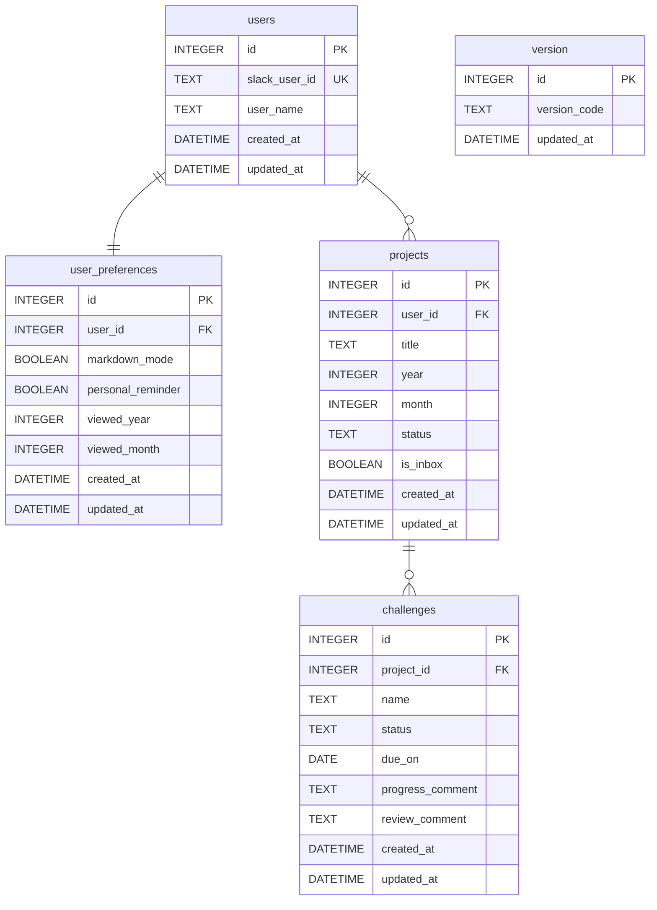

# データベース設計書

## 概要

Cloudflare D1（SQLite）を使用した永続化層の全テーブル定義。
マイグレーションは `wrangler d1 migrations` で管理する。

## ER 図



## テーブル定義

### `users`

| カラム | 型 | 制約 | 説明 |
|--------|-----|------|------|
| `id` | INTEGER | PK, AUTOINCREMENT | 内部ID |
| `slack_user_id` | TEXT | NOT NULL, UNIQUE | Slack ユーザーID |
| `user_name` | TEXT | NOT NULL | Slack 表示名 |
| `created_at` | DATETIME | DEFAULT CURRENT_TIMESTAMP | 登録日時 |
| `updated_at` | DATETIME | DEFAULT CURRENT_TIMESTAMP | 更新日時 |

> ドメイン上の呼称は「挑戦者（Challenger）」。Lazy Provision により自動作成される。

---

### `user_preferences`

| カラム | 型 | デフォルト | 説明 |
|--------|-----|-----------|------|
| `id` | INTEGER | PK, AUTOINCREMENT | 内部ID |
| `user_id` | INTEGER | FK → users.id, UNIQUE | ユーザー（1:1） |
| `markdown_mode` | BOOLEAN | `FALSE` | `/cem_new` モーダルのマークダウン入力モード |
| `personal_reminder` | BOOLEAN | `FALSE` | 個人DM通知のオプトイン |
| `viewed_year` | INTEGER | `NULL` | App Home 表示年（NULL = 現在年） |
| `viewed_month` | INTEGER | `NULL` | App Home 表示月（NULL = 現在月） |
| `created_at` | DATETIME | CURRENT_TIMESTAMP | 作成日時 |
| `updated_at` | DATETIME | CURRENT_TIMESTAMP | 更新日時 |

> users レコード作成と同時に自動生成される。

---

### `projects`

| カラム | 型 | 制約 | 説明 |
|--------|-----|------|------|
| `id` | INTEGER | PK, AUTOINCREMENT | 内部ID |
| `user_id` | INTEGER | FK → users.id, NOT NULL | 所有ユーザー |
| `title` | TEXT | NOT NULL | プロジェクト名（最大100文字） |
| `year` | INTEGER | NOT NULL | 対象年（例: 2026） |
| `month` | INTEGER | NOT NULL | 対象月（1〜12） |
| `status` | TEXT | NOT NULL, DEFAULT `'draft'` | `draft` / `published` / `reviewed` |
| `is_inbox` | BOOLEAN | NOT NULL, DEFAULT `FALSE` | プロジェクト未指定チャレンジの受け皿 |
| `created_at` | DATETIME | DEFAULT CURRENT_TIMESTAMP | 作成日時 |
| `updated_at` | DATETIME | DEFAULT CURRENT_TIMESTAMP | 更新日時 |

**status 遷移：**
```
draft → published → reviewed
```

---

### `challenges`

| カラム | 型 | 制約 | 説明 |
|--------|-----|------|------|
| `id` | INTEGER | PK, AUTOINCREMENT | 内部ID |
| `project_id` | INTEGER | FK → projects.id, NOT NULL | 所属プロジェクト |
| `name` | TEXT | NOT NULL | チャレンジ名（最大200文字） |
| `status` | TEXT | NOT NULL, DEFAULT `'draft'` | ステータス（下記参照） |
| `due_on` | DATE | NULL | 期日（任意） |
| `progress_comment` | TEXT | NULL | 進捗コメント（⋮ メニューから入力） |
| `review_comment` | TEXT | NULL | 振り返りコメント（`/cem_review` 時に入力） |
| `created_at` | DATETIME | DEFAULT CURRENT_TIMESTAMP | 作成日時 |
| `updated_at` | DATETIME | DEFAULT CURRENT_TIMESTAMP | 更新日時 |

**status 遷移：**
```
draft → not_started → in_progress → completed
（publish時）（進捗報告で）         ↘ incompleted（振り返り時のみ）
```

| status | 意味 | アイコン |
|--------|------|---------|
| `draft` | 未公開（publish前） | ⚪ |
| `not_started` | 公開済・未着手 | 🔴 |
| `in_progress` | 進行中 | 🔵 |
| `completed` | 達成 | ✅ |
| `incompleted` | 未達成（確定） | ❌ |

---

### `version`

| カラム | 型 | 制約 | 説明 |
|--------|-----|------|------|
| `id` | INTEGER | PK, DEFAULT 1 | 固定ID |
| `version_code` | TEXT | NOT NULL | バージョン文字列（例: `v0.0.1`） |
| `updated_at` | DATETIME | DEFAULT CURRENT_TIMESTAMP | 更新日時 |

> ヘルスチェック・DB 接続確認用。初期値 `v0.0.1`。

---

## DDL（schema.sql）

```sql
-- users
CREATE TABLE IF NOT EXISTS users (
  id            INTEGER  PRIMARY KEY AUTOINCREMENT,
  slack_user_id TEXT     NOT NULL UNIQUE,
  user_name     TEXT     NOT NULL,
  created_at    DATETIME DEFAULT CURRENT_TIMESTAMP,
  updated_at    DATETIME DEFAULT CURRENT_TIMESTAMP
);

-- user_preferences
CREATE TABLE IF NOT EXISTS user_preferences (
  id                INTEGER  PRIMARY KEY AUTOINCREMENT,
  user_id           INTEGER  NOT NULL UNIQUE REFERENCES users(id) ON DELETE CASCADE,
  markdown_mode     BOOLEAN  NOT NULL DEFAULT FALSE,
  personal_reminder BOOLEAN  NOT NULL DEFAULT FALSE,
  viewed_year       INTEGER  DEFAULT NULL,
  viewed_month      INTEGER  DEFAULT NULL,
  created_at        DATETIME DEFAULT CURRENT_TIMESTAMP,
  updated_at        DATETIME DEFAULT CURRENT_TIMESTAMP
);

-- projects
CREATE TABLE IF NOT EXISTS projects (
  id         INTEGER  PRIMARY KEY AUTOINCREMENT,
  user_id    INTEGER  NOT NULL REFERENCES users(id) ON DELETE CASCADE,
  title      TEXT     NOT NULL CHECK(length(title) <= 100),
  year       INTEGER  NOT NULL CHECK(year >= 2020),
  month      INTEGER  NOT NULL CHECK(month BETWEEN 1 AND 12),
  status     TEXT     NOT NULL DEFAULT 'draft'
             CHECK(status IN ('draft', 'published', 'reviewed')),
  is_inbox   BOOLEAN  NOT NULL DEFAULT FALSE,
  created_at DATETIME DEFAULT CURRENT_TIMESTAMP,
  updated_at DATETIME DEFAULT CURRENT_TIMESTAMP
);

-- challenges
CREATE TABLE IF NOT EXISTS challenges (
  id               INTEGER  PRIMARY KEY AUTOINCREMENT,
  project_id       INTEGER  NOT NULL REFERENCES projects(id) ON DELETE CASCADE,
  name             TEXT     NOT NULL CHECK(length(name) <= 200),
  status           TEXT     NOT NULL DEFAULT 'draft'
                   CHECK(status IN ('draft', 'not_started', 'in_progress', 'completed', 'incompleted')),
  due_on           DATE     DEFAULT NULL,
  progress_comment TEXT     DEFAULT NULL,
  review_comment   TEXT     DEFAULT NULL,
  created_at       DATETIME DEFAULT CURRENT_TIMESTAMP,
  updated_at       DATETIME DEFAULT CURRENT_TIMESTAMP
);

-- version（ヘルスチェック用）
CREATE TABLE IF NOT EXISTS version (
  id           INTEGER  PRIMARY KEY DEFAULT 1,
  version_code TEXT     NOT NULL,
  updated_at   DATETIME DEFAULT CURRENT_TIMESTAMP
);
INSERT OR IGNORE INTO version (id, version_code) VALUES (1, 'v0.0.1');
```

## D1 バインディング

```typescript
type Bindings = {
  DB: D1Database;
};
```
