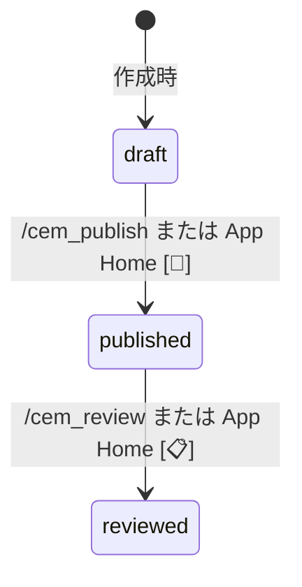
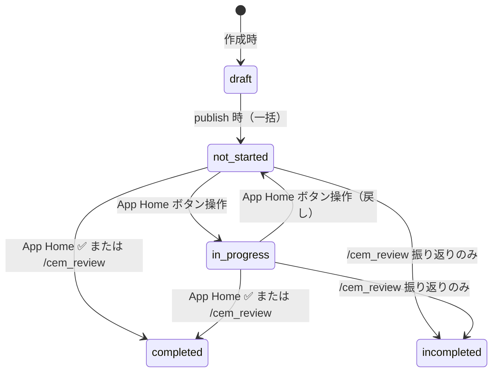
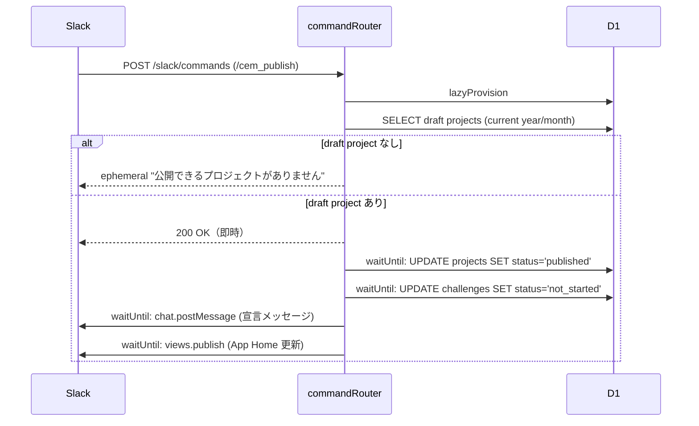
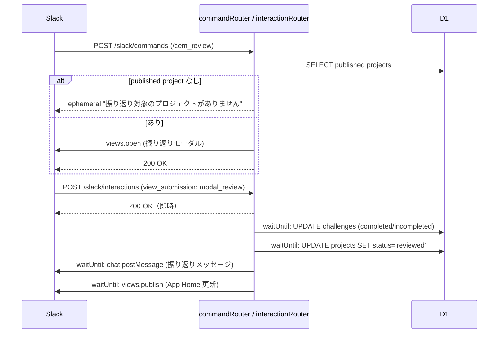

# 表明・進捗・振り返り 設計書

## 概要

月次チャレンジのライフサイクル（publish → progress → review）を担うサービス層の設計。
全ての副作用（DB 更新・チャンネル投稿・App Home 再描画）は `waitUntil()` 経由で実行する。

---

## 状態遷移図

### Project status



### Challenge status



> `completed` / `incompleted` は Project が `reviewed` になると変更不可。

---

## サービス関数シグネチャ

```typescript
// src/services/lifecycle.ts

/**
 * draft Project を published に一括遷移。
 * 配下の Challenge を not_started に更新。
 */
export async function publishProjects(
  db: D1Database,
  userId: number,
  year: number,
  month: number,
): Promise<ProjectWithChallenges[]>;
// 対象なし → 空配列を返す（呼び出し元がエフェメラル通知を判断）

/**
 * Challenge の status を更新する（not_started / in_progress / completed）。
 * App Home ボタン操作に対応。
 */
export async function updateChallengeStatus(
  db: D1Database,
  challengeId: number,
  status: "not_started" | "in_progress" | "completed",
  userId: number,
): Promise<ChallengeRow>;

/**
 * Challenge の progress_comment を保存する（⋮ メニュー）。
 */
export async function saveChallengeProgressComment(
  db: D1Database,
  challengeId: number,
  comment: string,
  userId: number,
): Promise<ChallengeRow>;

/**
 * 振り返りを確定する。
 * - 各 Challenge を completed / incompleted に更新
 * - 対象 Project を reviewed に更新
 */
export async function reviewProjects(
  db: D1Database,
  userId: number,
  decisions: ReviewDecision[],
): Promise<ProjectWithChallenges[]>;

// src/services/slack-post.ts

/** チャンネルにメッセージを投稿する */
export async function postToChannel(
  botToken: string,
  channelId: string,
  text: string,
  blocks?: unknown[],
): Promise<void>;

/** ユーザーへのエフェメラル通知 */
export async function postEphemeral(
  botToken: string,
  channelId: string,
  userId: string,
  text: string,
): Promise<void>;
```

---

## /cem_publish フロー



---

## /cem_review フロー



---

## チャンネル投稿メッセージ設計

### 宣言メッセージ（publish）

```typescript
// src/views/messages.ts

export function buildPublishBlocks(
  userName: string,
  year: number,
  month: number,
  projects: ProjectWithChallenges[],
): unknown[];
```

**テキスト構造:**
```
{user_name} さんが {year}年{month}月の挑戦を表明しました

*{project_title}*
• {challenge_name}
• {challenge_name}

*{project_title_2}*
• {challenge_name}
```

### 進捗メッセージ（progress report）

```typescript
export function buildProgressBlocks(
  userName: string,
  year: number,
  month: number,
  projects: ProjectWithChallenges[],
): unknown[];
```

**テキスト構造:**
```
{user_name} さんが {year}年{month}月の進捗を報告しました

*{project_title}*
🔴 {challenge_name}（未着手）
🔵 {challenge_name}（進行中）　{progress_comment}
✅ {challenge_name}（達成済）
```

### 振り返りメッセージ（review）

```typescript
export function buildReviewBlocks(
  userName: string,
  year: number,
  month: number,
  projects: ProjectWithChallenges[],
): unknown[];
```

**テキスト構造:**
```
{user_name} さんが {year}年{month}月の振り返りをしました

*{project_title}*
✅ {challenge_name}
❌ {challenge_name}
{review_comment}
```

---

## /cem_review モーダル設計

**callback_id**: `modal_review`

```
┌─────────────────────────────────────┐
│ {year}年{month}月の振り返り          │
├─────────────────────────────────────┤
│ *{project_title}*                   │
│                                     │
│ {challenge_name}                    │
│ [✅ 達成] [❌ 未達成]               │
│   block_id: select_challenge_result_{challenge_id}
│                                     │
│ 振り返りコメント（任意）             │
│ [___________________________]       │
│   block_id: input_review_comment_{project_id}
│                                     │
│ ── 次の project ... ──              │
└─────────────────────────────────────┘
```

**バリデーション（view_submission 時）:**
- 全 Challenge の result が未選択 → `response_action: "errors"` で警告

---

## エラーハンドリング表

| 条件 | 処理 |
|------|------|
| draft project がない（publish 時）| ephemeral 通知 |
| published project がない（review 時）| ephemeral 通知 |
| 既に reviewed な project への review | ephemeral 通知 |
| review モーダルで未選択 challenge あり | modal errors で警告 |
| チャンネル投稿失敗 | DB ロールバックなし・ephemeral 通知でエラーを伝える |
| Challenge status の不正な遷移 | 400 で拒否 |
