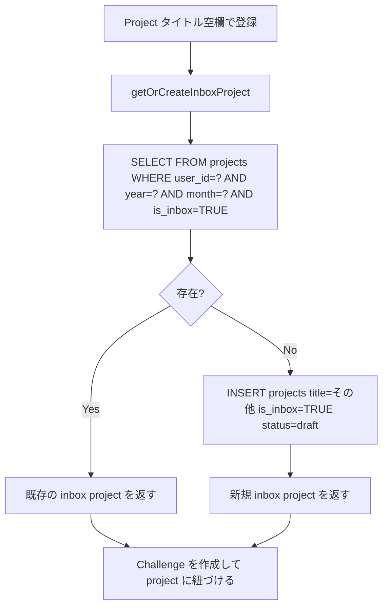
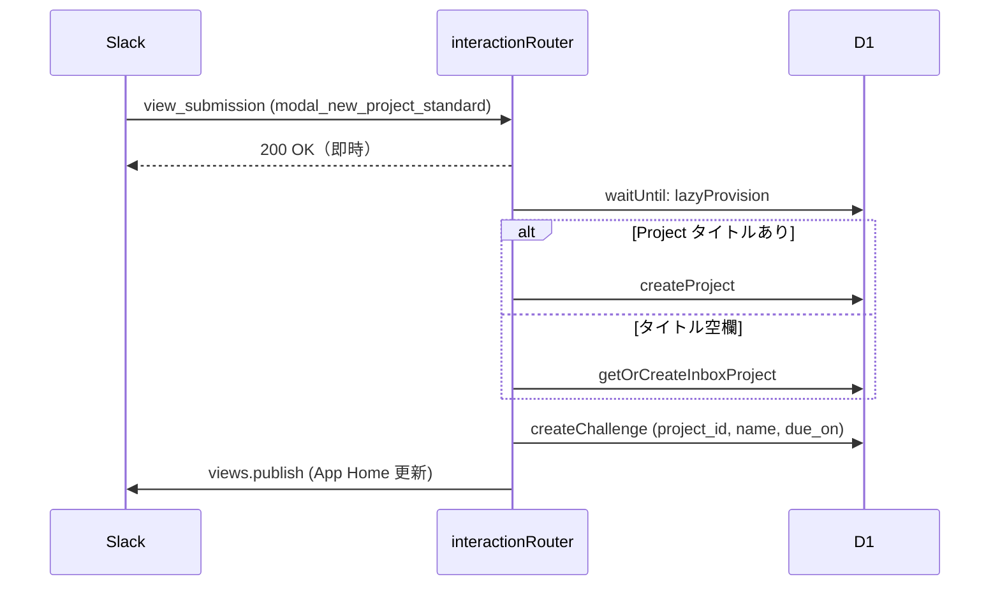

# 目標管理（Project / Challenge）設計書

## 概要

`/cem_new` / `/cem_edit` / `/cem_delete` を入口とした Project / Challenge の CRUD、
および Inbox Project の自動作成、マークダウン入力パーサーの設計。

---

## サービス関数シグネチャ

```typescript
// src/services/project.ts

export async function getProjectsWithChallenges(
  db: D1Database,
  userId: number,
  year: number,
  month: number,
): Promise<ProjectWithChallenges[]>;

export async function createProject(
  db: D1Database,
  input: CreateProjectInput,
): Promise<ProjectRow>;

/** is_inbox=true の Project を取得。存在しなければ自動作成 */
export async function getOrCreateInboxProject(
  db: D1Database,
  userId: number,
  year: number,
  month: number,
): Promise<ProjectRow>;

export async function updateProject(
  db: D1Database,
  projectId: number,
  input: UpdateProjectInput,
): Promise<ProjectRow>;

export async function deleteProject(
  db: D1Database,
  projectId: number,
): Promise<void>;

// src/services/challenge.ts

export async function createChallenge(
  db: D1Database,
  input: CreateChallengeInput,
): Promise<ChallengeRow>;

export async function updateChallenge(
  db: D1Database,
  challengeId: number,
  input: UpdateChallengeInput,
): Promise<ChallengeRow>;

export async function deleteChallenge(
  db: D1Database,
  challengeId: number,
): Promise<void>;

export async function countChallenges(
  db: D1Database,
  projectId: number,
): Promise<number>;
```

---

## 所有権検証

全ての UPDATE / DELETE 前に実行する。

```typescript
// src/services/authorization.ts

/** 所有者でなければ 403、存在しなければ 404 を throw */
export async function assertProjectOwner(
  db: D1Database,
  projectId: number,
  userId: number,
): Promise<ProjectRow>;

export async function assertChallengeOwner(
  db: D1Database,
  challengeId: number,
  userId: number,
): Promise<ChallengeRow>;
```

---

## バリデーション

| フィールド | ルール | エラー |
|----------|--------|--------|
| `year` | 2020 以上の整数 | 400 `INVALID_YEAR_MONTH` |
| `month` | 1 〜 12 | 400 `INVALID_YEAR_MONTH` |
| `title` | 100 文字以内 | 400 |
| `name` | 200 文字以内 | 400 |
| Challenge 数 | 1 Project あたり 20 件以内 | 409 `CHALLENGE_LIMIT_EXCEEDED` |
| `reviewed` Project への更新・削除 | 禁止 | 409 `PROJECT_ALREADY_REVIEWED` |

---

## /cem_new モーダル設計

### 標準モード（`markdown_mode=false`、デフォルト）

**callback_id**: `modal_new_project_standard`

```
┌────────────────────────────────────┐
│ 新しいチャレンジを登録              │
├────────────────────────────────────┤
│ Project タイトル（任意）            │
│ [___________________________]      │
│                                    │
│ Challenge 名（必須）               │
│ [___________________________]      │
│                                    │
│ 期日（任意）                       │
│ [日付ピッカー]                     │
└────────────────────────────────────┘
```

| block_id | action_id | 種別 | 必須 |
|----------|-----------|------|------|
| `input_project_title` | `input_project_title` | plain_text_input | No |
| `input_challenge_name_0` | `input_challenge_name_0` | plain_text_input | Yes |
| `input_due_on_0` | `input_due_on_0` | datepicker | No |

### マークダウンモード（`markdown_mode=true`）

**callback_id**: `modal_new_project_markdown`

| block_id | action_id | 種別 |
|----------|-----------|------|
| `input_markdown_text` | `input_markdown_text` | plain_text_input（multiline=true）|

---

## マークダウンパーサー設計

### 関数シグネチャ

```typescript
// src/utils/markdown-parser.ts

/**
 * マークダウン形式のテキストを ParsedProject[] に変換する。
 * @param text         入力テキスト
 * @param contextYear  @15 などの省略記法を解釈する基準年
 * @param contextMonth 同上（基準月）
 */
export function parseMarkdownInput(
  text: string,
  contextYear: number,
  contextMonth: number,
): ParsedProject[];

/** テキストから @due 記法を抽出し、name と due_on に分割する */
export function extractDueDate(
  text: string,
  contextYear: number,
  contextMonth: number,
): { name: string; due_on: string | null };
```

### パースアルゴリズム

```
function parseMarkdownInput(text, contextYear, contextMonth):
  lines = text.split('\n')
  projects = []
  currentProject = { title: null, challenges: [] }  // inbox 受け皿

  for line of lines:
    trimmed = line.trim()
    if trimmed === "": continue

    if trimmed.startsWith("# "):
      // 現在の project を確定（challenge が 1件以上あれば push）
      if currentProject.challenges.length > 0:
        projects.push(currentProject)
      // 新しい project を開始
      currentProject = { title: trimmed.slice(2).trim(), challenges: [] }

    else if trimmed.startsWith("- "):
      rawText = trimmed.slice(2)
      { name, due_on } = extractDueDate(rawText, contextYear, contextMonth)
      currentProject.challenges.push({ name: name.trim(), due_on })

  // 最後の project を確定
  if currentProject.challenges.length > 0:
    projects.push(currentProject)

  return projects
```

### 期日（@）パースアルゴリズム

```typescript
function extractDueDate(text, contextYear, contextMonth):
  // 優先順位: 長いパターンから順にマッチ
  // 1. @YYYY-MM-DD (完全指定)
  match = text.match(/@(\d{4})-(\d{2})-(\d{2})/)
  if match: return { name: text.replace(match[0], "").trim(), due_on: match[1] + "-" + match[2] + "-" + match[3] }

  // 2. @MM-DD (当年)
  match = text.match(/@(\d{2})-(\d{2})/)
  if match: return { name: text.replace(match[0], "").trim(), due_on: contextYear + "-" + match[1] + "-" + match[2] }

  // 3. @D または @DD (当月当年)
  match = text.match(/@(\d{1,2})$/)
  if match:
    day = zeroPad(parseInt(match[1], 10), 2)
    month = zeroPad(contextMonth, 2)
    return { name: text.replace(match[0], "").trim(), due_on: contextYear + "-" + month + "-" + day }

  return { name: text, due_on: null }
```

### パース例

```
入力テキスト（contextYear=2026, contextMonth=3）:

# 英語学習
- Anki 30分 @15
- Podcast 聴く @03-20
- 洋書読む @2026-03-31

- 筋トレ

出力:
[
  {
    title: "英語学習",
    challenges: [
      { name: "Anki 30分",    due_on: "2026-03-15" },
      { name: "Podcast 聴く", due_on: "2026-03-20" },
      { name: "洋書読む",     due_on: "2026-03-31" },
    ]
  },
  {
    title: null,   // inbox
    challenges: [
      { name: "筋トレ", due_on: null },
    ]
  }
]
```

---

## Inbox Project 自動作成フロー



---

## データフロー: `/cem_new` 標準モード 送信



---

## エラーハンドリング表

| 条件 | HTTP Status | AppErrorCode |
|------|-------------|-------------|
| `year` / `month` が範囲外 | 400 | `INVALID_YEAR_MONTH` |
| Project / Challenge が存在しない | 404 | `PROJECT_NOT_FOUND` / `CHALLENGE_NOT_FOUND` |
| 他ユーザーの Project への操作 | 403 | `FORBIDDEN` |
| `reviewed` Project への更新・削除 | 409 | `PROJECT_ALREADY_REVIEWED` |
| Challenge 数が 20件超 | 409 | `CHALLENGE_LIMIT_EXCEEDED` |
| DB 書き込み失敗 | 500 | `DB_ERROR` |
