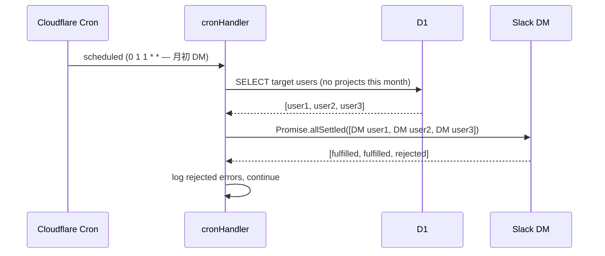

# リマインダー 設計書

## 概要

Cloudflare Cron Triggers を用いた定期通知の設計。
`scheduled` イベントハンドラーで発火時刻を判定し、対応するサブハンドラーに委譲する。

---

## Cron スケジュールとハンドラー対応表

| cron式 (UTC) | JST | ハンドラー関数 |
|-------------|-----|--------------|
| `0 0 1 * *` | 毎月1日 9:00 | `handleMonthStartChannel` |
| `0 1 1 * *` | 毎月1日 10:00 | `handleMonthStartDm` |
| `0 0 15 * *` | 毎月15日 9:00 | `handleMidMonthChannel` |
| `0 0 25 * *` | 毎月25日 9:00 | `handleMonthEndChannel` |
| `0 1 25 * *` | 毎月25日 10:00 | `handleMonthEndDm` |
| `0 0 * * *` | 毎日 9:00 | `handleDueSoonDm` |

> `0 0 * * *` は全日（月初・月末含む）発火するが、`handleDueSoonDm` は他ハンドラーと並列実行する。

---

## エントリーポイント

**ファイル**: `src/scheduled/index.ts`

```typescript
export async function cronHandler(
  event: ScheduledEvent,
  env: Env,
  ctx: ExecutionContext,
): Promise<void>;
```

### ディスパッチロジック

```typescript
const date  = new Date(event.scheduledTime);
const utcHour = date.getUTCHours();
const utcDay  = date.getUTCDate();
const month   = date.getUTCMonth() + 1; // 1-12
const year    = date.getUTCFullYear();

const tasks: Promise<void>[] = [];

if (utcDay === 1 && utcHour === 0)  tasks.push(handleMonthStartChannel(env, year, month));
if (utcDay === 1 && utcHour === 1)  tasks.push(handleMonthStartDm(env, year, month));
if (utcDay === 15 && utcHour === 0) tasks.push(handleMidMonthChannel(env, year, month));
if (utcDay === 25 && utcHour === 0) tasks.push(handleMonthEndChannel(env, year, month));
if (utcDay === 25 && utcHour === 1) tasks.push(handleMonthEndDm(env, year, month));
if (utcHour === 0)                  tasks.push(handleDueSoonDm(env, year, month));

await Promise.allSettled(tasks);
// ↑ 1つのハンドラーが失敗しても他を継続する
```

---

## 各ハンドラーの設計

### handleMonthStartChannel

```typescript
// src/scheduled/month-start.ts

export async function handleMonthStartChannel(
  env: Env,
  year: number,
  month: number,
): Promise<void>;
```

**処理:**
1. `month === 1` の場合: 新年メッセージを `SLACK_POST_CHANNEL_ID` に投稿
2. それ以外: 通常の月初メッセージを投稿

---

### handleMonthStartDm

```typescript
export async function handleMonthStartDm(
  env: Env,
  year: number,
  month: number,
): Promise<void>;
```

**対象ユーザー抽出クエリ:**
```sql
SELECT u.slack_user_id
FROM users u
JOIN user_preferences up ON up.user_id = u.id
WHERE up.personal_reminder = TRUE
  AND NOT EXISTS (
    SELECT 1 FROM projects p
    WHERE p.user_id = u.id
      AND p.year = ? AND p.month = ?
  )
```

**処理:** 取得した `slack_user_id` の全員に DM を `Promise.allSettled` で並列送信。

---

### handleMidMonthChannel

```typescript
export async function handleMidMonthChannel(
  env: Env,
  year: number,
  month: number,
): Promise<void>;
```

**処理:** `SLACK_POST_CHANNEL_ID` に月中メッセージを投稿。

---

### handleMonthEndChannel

```typescript
export async function handleMonthEndChannel(
  env: Env,
  year: number,
  month: number,
): Promise<void>;
```

**処理:**
1. `month === 12` の場合: 年末メッセージを投稿
2. それ以外: 通常の月末メッセージを投稿

---

### handleMonthEndDm

```typescript
export async function handleMonthEndDm(
  env: Env,
  year: number,
  month: number,
): Promise<void>;
```

**対象ユーザー抽出クエリ:**
```sql
SELECT u.slack_user_id
FROM users u
JOIN user_preferences up ON up.user_id = u.id
WHERE up.personal_reminder = TRUE
  AND EXISTS (
    SELECT 1 FROM projects p
    WHERE p.user_id = u.id
      AND p.year = ? AND p.month = ?
      AND p.status = 'published'
  )
```

**処理:** 取得したユーザーに未振り返り DM を `Promise.allSettled` で並列送信。

---

### handleDueSoonDm

```typescript
export async function handleDueSoonDm(
  env: Env,
  year: number,
  month: number,
): Promise<void>;
```

**対象 Challenge 抽出クエリ:**
```sql
SELECT
  c.id,
  c.name,
  c.due_on,
  p.title   AS project_title,
  u.slack_user_id
FROM challenges c
JOIN projects  p  ON p.id = c.project_id
JOIN users     u  ON u.id = p.user_id
JOIN user_preferences up ON up.user_id = u.id
WHERE up.personal_reminder = TRUE
  AND c.status NOT IN ('completed', 'incompleted')
  AND c.due_on BETWEEN date('now') AND date('now', '+3 days')
ORDER BY u.slack_user_id, c.due_on
```

**処理:**
1. 結果を `slack_user_id` でグループ化
2. ユーザーごとに 1通のDMにまとめて送信（`Promise.allSettled`）

---

## Slack API 関数シグネチャ

```typescript
// src/services/slack-post.ts（再掲 + 追加）

/** Bot として DM を送信する */
export async function postDm(
  botToken: string,
  slackUserId: string,
  text: string,
): Promise<void>;
```

---

## 通知メッセージテンプレート

| ハンドラー | メッセージ |
|---------|----------|
| 月初チャンネル（通常）| `<!channel>\n新しい月の始まりです！今月も目標を立てて一歩一歩行きましょう 💪\nLet's Challenge！` |
| 月初チャンネル（1月）| `<!channel>\n謹賀新年！新しい年の始まりです 🎍\n今年はどんな年にしましょうか？今月の目標を立てて、Let's Challenge！` |
| 月初 DM（未設定）| `今月の目標をまだ設定していません 📝\n/cem_new で今月のチャレンジを登録しましょう！` |
| 月中チャンネル | `<!channel>\n月の折り返し地点です 📊 進捗どうですか？\n/cem_progress で現状を報告してみましょう！` |
| 月末チャンネル（通常）| `<!channel>\n今月もお疲れさまでした 🎉\n振り返りをして今月を締めくくりましょう！ /cem_review` |
| 月末チャンネル（12月）| `<!channel>\n今年もお疲れさまでした！🎊\n振り返りをして良い年締めくくりを！ /cem_review` |
| 月末 DM（未振り返り）| `今月の振り返りがまだです ✍️\n/cem_review で達成・未達成を確定しましょう！` |
| 期日接近 DM | `期日が近づいているチャレンジがあります ⏰\n\n• {project_title} / {challenge_name}（期日: {due_on}）` |

---

## 冪等性の方針

| ハンドラー | 冪等戦略 |
|---------|---------|
| チャンネル投稿 | **なし**（二重投稿を許容）— 小規模コミュニティのため |
| 個人 DM | **なし**（重複 DM を許容）— 月1〜2回の通知のため |

> 大規模化した場合は `sent_notifications (user_id, cron_key, sent_at)` テーブルで管理する。

---

## エラー処理方針

| エラー種別 | 対応 |
|---------|------|
| チャンネル投稿失敗 | console.error でログ → 処理継続 |
| 一部ユーザーへの DM 送信失敗 | `Promise.allSettled` で個別エラーをログ → 残りのユーザーへ継続 |
| D1 クエリ失敗 | console.error でログ → ハンドラー全体を中断（当該 cron のみ失敗） |
| ユーザー 0 件 | 空のループとして正常終了 |

---

## シーケンス図: DM リマインダー


