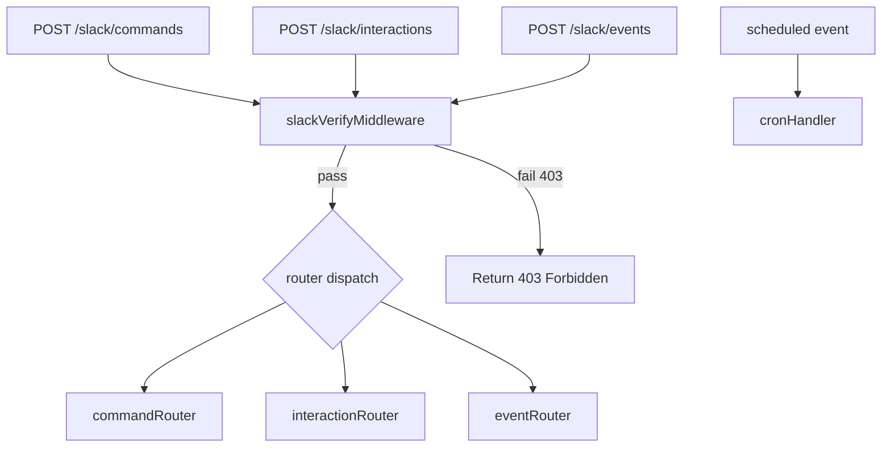
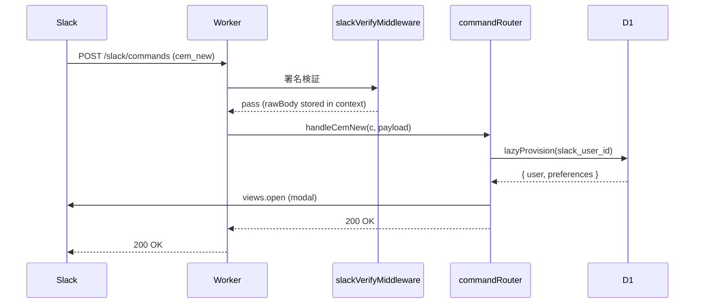
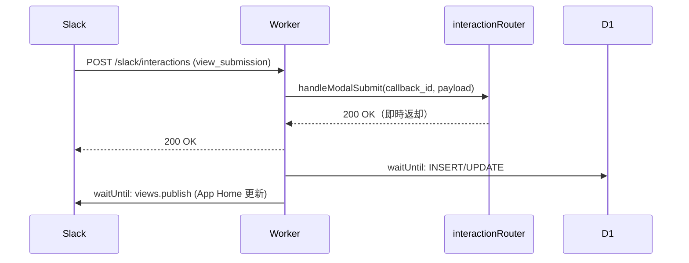

# Slack Webhook & Middleware 設計書

## 概要

Hono on Cloudflare Workers の Slack リクエスト受付レイヤーの設計。
`slackVerifyMiddleware` による署名検証と、3系統のルーター（commands / interactions / events）で構成する。

## ルーター構成



## エントリーポイント構成

**ファイル**: `src/index.ts`

```typescript
// src/index.ts
const app = new Hono<{ Bindings: Env }>();

app.use("/slack/*", slackVerifyMiddleware);

app.post("/slack/commands",     commandRouter);
app.post("/slack/interactions", interactionRouter);
app.post("/slack/events",       eventRouter);

export default {
  fetch: app.fetch,
  scheduled: cronHandler,
};
```

---

## Middleware: `slackVerifyMiddleware`

**ファイル**: `src/middleware/slack-verify.ts`

### 処理フロー

```mermaid
flowchart TD
    A[リクエスト受信] --> B{X-Slack-Retry-Num あり?}
    B -->|Yes| C[return 200 empty]
    B -->|No| D[X-Slack-Request-Timestamp 取得]
    D --> E{|現在時刻 - timestamp| > 300秒?}
    E -->|Yes| F[return 403]
    E -->|No| G[rawBody = await c.req.text()]
    G --> H[c.set rawBody]
    H --> I[HMAC-SHA256 計算]
    I --> J{expected === X-Slack-Signature?}
    J -->|No| K[return 403]
    J -->|Yes| L[next]
```

### 署名検証アルゴリズム

```
1. basestring = "v0:" + timestamp + ":" + rawBody
2. key = SLACK_SIGNING_SECRET (UTF-8 bytes)
3. expected = "v0=" + hex(HMAC-SHA256(key, basestring))
4. 比較: timingSafeEqual(expected, X-Slack-Signature)
```

> **注意**: Workers では Node.js `crypto` モジュール不可。`crypto.subtle` を使用すること。

### 関数シグネチャ

```typescript
// src/middleware/slack-verify.ts

export const slackVerifyMiddleware: MiddlewareHandler<{ Bindings: Env }>;

/** テスト可能なように export する */
export async function verifySlackSignature(opts: {
  signingSecret: string;
  timestamp: string;
  rawBody: string;
  signature: string;
}): Promise<boolean>;

/** 定数時間比較（タイミング攻撃対策） */
export function timingSafeEqual(a: string, b: string): boolean;
```

---

## コマンドルーター

**ファイル**: `src/routes/commands.ts`

| `command` 値 | ハンドラー関数 | 処理方針 |
|-------------|-------------|---------|
| `/cem_new` | `handleCemNew` | views.open（同期）|
| `/cem_edit` | `handleCemEdit` | views.open（同期）|
| `/cem_delete` | `handleCemDelete` | views.open（同期）|
| `/cem_publish` | `handleCemPublish` | 即時 200 → waitUntil で DB + 投稿 |
| `/cem_progress` | `handleCemProgress` | views.open（同期）|
| `/cem_review` | `handleCemReview` | views.open（同期）|
| `/cem_settings` | `handleCemSettings` | views.open（同期）|
| その他 | - | ephemeral "unknown command" + 200 |

**全コマンド共通の冒頭処理:**
1. body を `URLSearchParams` でパース → `SlackCommandPayload`
2. `lazyProvision(db, payload.user_id, payload.user_name)` を **同期で** 実行

---

## インタラクションルーター

**ファイル**: `src/routes/interactions.ts`

| `type` | dispatch キー | マッチ方法 |
|--------|-------------|-----------|
| `block_actions` | `action_id` | exact match |
| `view_submission` | `callback_id` | exact match |
| `view_closed` | `callback_id` | exact match（基本無視） |

### action_id 一覧

| action_id | 操作 | value に渡すデータ |
|-----------|-----|----------------|
| `home_nav_prev` | [← 前月] ナビ | `"{year}-{month}"` (表示中の年月) |
| `home_nav_next` | [次月 →] ナビ | `"{year}-{month}"` |
| `home_open_new_project` | ＋ プロジェクト追加 | - |
| `home_open_add_challenge` | + チャレンジ追加 | `"{project_id}"` |
| `home_open_edit_project` | ✏️ 編集 | `"{project_id}"` |
| `home_confirm_delete_project` | 🗑️ 削除 | `"{project_id}"` |
| `home_publish` | 📣 今月を宣言する | - |
| `home_review_complete` | 📋 振り返りを完了する | `"{project_id}"` |
| `challenge_set_not_started` | [未着手] ボタン | `"{challenge_id}"` |
| `challenge_set_in_progress` | [進行中] ボタン | `"{challenge_id}"` |
| `challenge_set_completed` | [✅済] ボタン | `"{challenge_id}"` |
| `challenge_open_comment` | ⋮ → コメントを追加 | `"{challenge_id}"` |
| `home_open_settings` | ⚙️ 設定 | - |

### callback_id 一覧

| callback_id | モーダル |
|-------------|---------|
| `modal_new_project_standard` | `/cem_new` 標準フォーム |
| `modal_new_project_markdown` | `/cem_new` マークダウンモード |
| `modal_edit_project` | `/cem_edit` |
| `modal_delete_project_confirm` | 削除確認ダイアログ |
| `modal_progress_report` | `/cem_progress` |
| `modal_review` | `/cem_review` |
| `modal_challenge_comment` | コメント入力ミニモーダル |
| `modal_settings` | preferences 設定モーダル（App Home / `/cem_settings` 共通）|

### private_metadata で context を渡す

モーダルに動的な context を渡す場合は `private_metadata` に JSON 文字列を格納する:

```typescript
// 例: 編集モーダルを開く時
const metadata = JSON.stringify({ project_id: 42, year: 2026, month: 3 });
// modal view 内: private_metadata: metadata
```

---

## Block ID / Action ID 命名規則（入力フィールド）

`view.state.values[block_id][action_id]` で値を取得する。

| block_id | action_id | 用途 |
|----------|-----------|------|
| `input_project_title` | `input_project_title` | Project タイトル |
| `input_challenge_name_0` | `input_challenge_name_0` | Challenge 名（n=0,1,...）|
| `input_due_on_0` | `input_due_on_0` | 期日ピッカー（n=0,1,...）|
| `input_markdown_text` | `input_markdown_text` | マークダウンモードテキストエリア |
| `input_progress_comment` | `input_progress_comment` | 進捗コメント |
| `input_review_comment_{pid}` | `input_review_comment_{pid}` | 振り返りコメント（pid=project_id）|
| `select_challenge_result_{cid}` | `select_challenge_result_{cid}` | 達成/未達成選択（cid=challenge_id）|

---

## イベントルーター

**ファイル**: `src/routes/events.ts`

| `event.type` | 処理 |
|-------------|------|
| `url_verification` | `challenge` をそのまま返す |
| `app_home_opened` | Lazy Provision → views.publish（waitUntil）|
| その他 | 無視（200 OK）|

---

## エラーレスポンス仕様

| 条件 | Status | Body |
|------|--------|------|
| 署名検証失敗 | 403 | `{"error":"Forbidden"}` |
| タイムスタンプ超過 | 403 | `{"error":"Forbidden"}` |
| Retry ヘッダーあり | 200 | `""` |
| 不正なリクエストボディ | 400 | `{"error":"Bad Request"}` |
| 正常（コマンド受理）| 200 | `""` or ephemeral JSON |

---

## シーケンス図: `/cem_new` コマンドフロー



## シーケンス図: `view_submission` フロー



---

## waitUntil 使用方針

| 処理 | 同期 / waitUntil | 理由 |
|------|-----------------|------|
| Lazy Provision | **同期** | 後続処理が user_id を必要とするため |
| `views.open` | **同期** | 3秒制限内に完了する必要があるため |
| DB 更新（publish/review）| **waitUntil** | 重い処理を 200 返却後に逃がす |
| `chat.postMessage` | **waitUntil** | Slack API 呼び出しは非クリティカルパス |
| `views.publish` | **waitUntil** | App Home 更新は即時性不要 |
