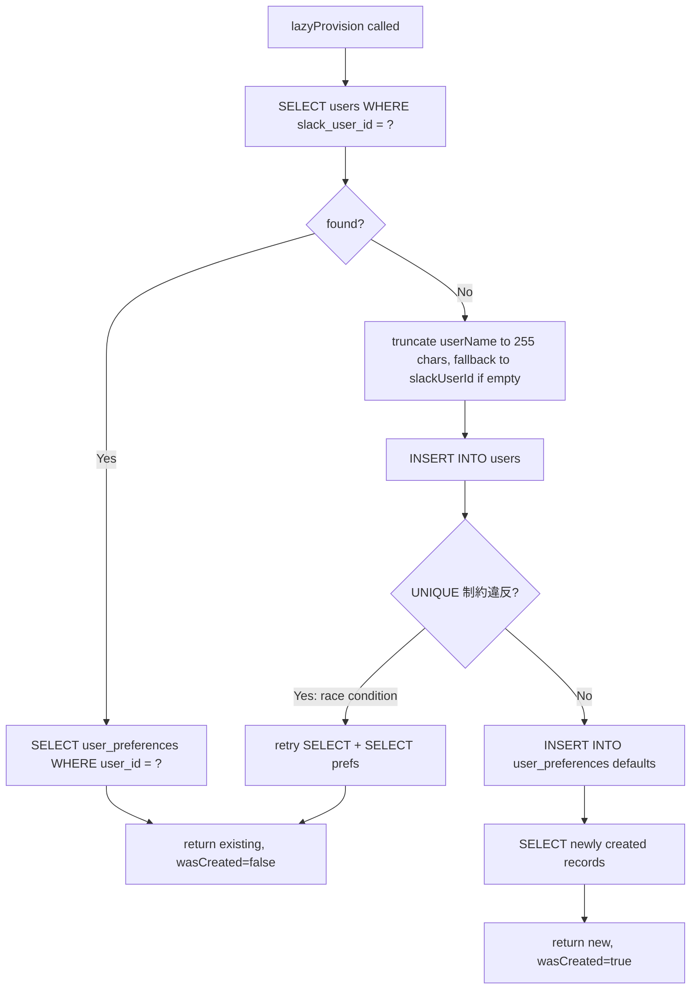
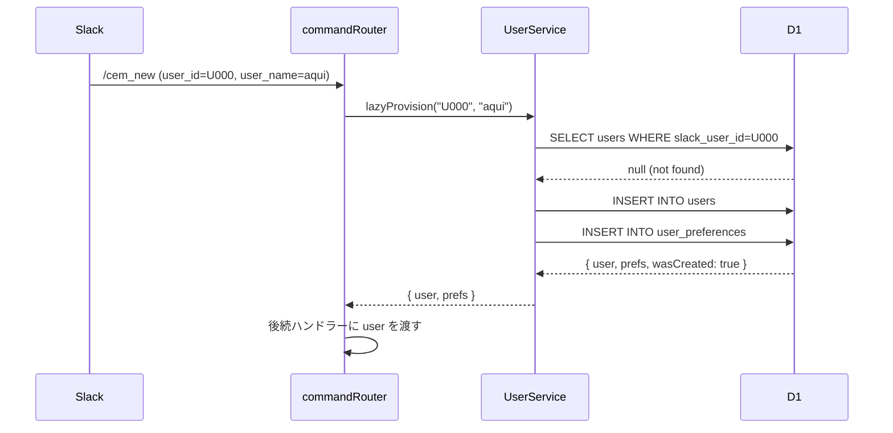

# ユーザー管理 設計書

## 概要

Lazy Provision パターンによるユーザー自動登録と、preferences 管理の設計。

## サービス関数シグネチャ

```typescript
// src/services/user.ts

/** Lazy Provision: ユーザーが存在すれば取得、なければ作成 */
export async function lazyProvision(
  db: D1Database,
  slackUserId: string,
  userName: string,
): Promise<LazyProvisionResult>;

/** slack_user_id でユーザー取得（存在しない場合は null）*/
export async function findUserBySlackId(
  db: D1Database,
  slackUserId: string,
): Promise<UserRow | null>;

/** preferences を部分更新 */
export async function updatePreferences(
  db: D1Database,
  userId: number,
  input: UpdatePreferencesInput,
): Promise<UserPreferencesRow>;
```

---

## Lazy Provision アルゴリズム

### フローチャート



### 擬似コード

```
function lazyProvision(db, slackUserId, userName):
  // 1. 存在確認
  existing = SELECT * FROM users WHERE slack_user_id = slackUserId
  if existing:
    prefs = SELECT * FROM user_preferences WHERE user_id = existing.id
    return { user: existing, preferences: prefs, wasCreated: false }

  // 2. 新規作成
  safeName = truncate(userName || slackUserId, 255)

  try:
    result = INSERT INTO users (slack_user_id, user_name) VALUES (slackUserId, safeName)
    userId  = result.meta.last_row_id

    INSERT INTO user_preferences (user_id) VALUES (userId)
    // ↑ defaults: markdown_mode=FALSE, personal_reminder=FALSE, viewed_year=NULL, viewed_month=NULL

    user  = SELECT * FROM users WHERE id = userId
    prefs = SELECT * FROM user_preferences WHERE user_id = userId
    return { user, preferences: prefs, wasCreated: true }

  catch UNIQUE_VIOLATION:
    // Race condition: 並行リクエストが同時に INSERT した
    existing = SELECT * FROM users WHERE slack_user_id = slackUserId
    prefs    = SELECT * FROM user_preferences WHERE user_id = existing.id
    return { user: existing, preferences: prefs, wasCreated: false }
```

---

## HTTP エンドポイント設計

### GET /users/:slack_user_id

**レスポンス 200:**
```json
{
  "slack_user_id": "U1234567890",
  "user_name": "aqui",
  "created_at": "2026-03-01T00:00:00.000Z"
}
```
> `id` は外部公開しない（NFR-USR-102）。

**エラー 404:**
```json
{ "error": "User not found" }
```

---

### PATCH /users/:slack_user_id/preferences

**リクエストボディ（全フィールド任意）:**
```json
{
  "markdown_mode": true,
  "personal_reminder": false,
  "viewed_year": 2026,
  "viewed_month": 3
}
```

**レスポンス 200（更新後の preferences）:**
```json
{
  "markdown_mode": true,
  "personal_reminder": false,
  "viewed_year": 2026,
  "viewed_month": 3
}
```

---

## エラーハンドリング表

| 条件 | HTTP Status | AppErrorCode |
|------|-------------|-------------|
| `slack_user_id` が空文字 | 400 | `INVALID_USER_ID` |
| `slack_user_id` が 255文字超 | 400 | `INVALID_USER_ID` |
| GET で対象ユーザーが存在しない | 404 | `USER_NOT_FOUND` |
| DB 書き込み失敗（UNIQUE 除く）| 500 | `DB_ERROR` |

---

## バリデーション

```typescript
// src/utils/validation.ts

/** slack_user_id の入力検証 */
export function validateSlackUserId(value: unknown): string {
  if (typeof value !== "string" || value.trim() === "") {
    throw appError("INVALID_USER_ID", "slack_user_id is required", 400);
  }
  if (value.length > 255) {
    throw appError("INVALID_USER_ID", "slack_user_id too long", 400);
  }
  return value;
}
```

---

## シーケンス図: 初回コマンド実行


