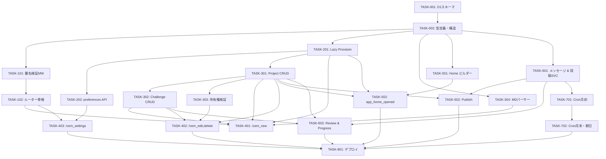

# CEM Jirou 実装タスク

## 概要

全タスク数: 21
クリティカルパス: TASK-001 → TASK-002 → TASK-101 → TASK-102 → TASK-201 → TASK-301〜304 → TASK-401〜404 → TASK-501〜503 → TASK-601〜604 → TASK-701〜703 → TASK-801

---

## タスク一覧

---

### フェーズ1: 基盤構築

#### TASK-001: D1 スキーマ & マイグレーション設定

- [ ] **タスク完了**
- **タスクタイプ**: DIRECT
- **要件リンク**: `docs/design/database-design.md`
- **依存タスク**: なし
- **実装詳細**:
  - `migrations/0001_init.sql` を作成（database-design.md の DDL そのまま）
  - `wrangler.toml` に D1 バインディング（`[[d1_databases]]`）を追記
  - `wrangler.toml` に Cron Triggers（`[triggers]`）を追記
  - `pnpm wrangler d1 create cem-jirou` でローカル DB 作成手順をドキュメント化
- **完了条件**:
  - [ ] `migrations/0001_init.sql` が存在し、全テーブル DDL を含む
  - [ ] `wrangler.toml` に `DB` バインディングが定義されている
  - [ ] `pnpm wrangler d1 migrations apply cem-jirou --local` でエラーなく適用できる

---

#### TASK-002: src/ ディレクトリ構造 & 共通型定義

- [ ] **タスク完了**
- **タスクタイプ**: DIRECT
- **要件リンク**: `docs/design/interfaces.ts`
- **依存タスク**: TASK-001
- **実装詳細**:
  - `src/types/index.ts` として `docs/design/interfaces.ts` の内容をコピー・整備
  - 以下のディレクトリを空の `index.ts` で作成:
    - `src/middleware/`
    - `src/routes/`
    - `src/services/`
    - `src/views/`
    - `src/scheduled/`
    - `src/utils/`
  - `src/index.ts` を Hono + Env 型付きのスケルトンに更新
- **完了条件**:
  - [ ] `src/types/index.ts` に全インターフェースが定義されている
  - [ ] `pnpm tsc --noEmit` がエラーなし

---

### フェーズ2: Slack インフラ層

#### TASK-101: Slack 署名検証 Middleware

- [ ] **タスク完了**
- **タスクタイプ**: TDD
- **要件リンク**: REQ-WH-001〜005, NFR-WH-101
- **依存タスク**: TASK-002
- **実装詳細**:
  - `src/middleware/slack-verify.ts` を実装
  - `verifySlackSignature(opts)` — `crypto.subtle` で HMAC-SHA256 計算
  - `timingSafeEqual(a, b)` — バイト単位 XOR による定数時間比較
  - `slackVerifyMiddleware` — タイムスタンプ検証 → rawBody 保存 → 署名照合
  - `X-Slack-Retry-Num` ヘッダー存在時は即時 200 でスキップ
- **テスト要件**:
  - [ ] 正常な署名 → `next()` が呼ばれる
  - [ ] 署名不一致 → 403
  - [ ] タイムスタンプが 301秒前 → 403
  - [ ] `X-Slack-Retry-Num` ヘッダーあり → 200（処理スキップ）
  - [ ] `timingSafeEqual` が同一文字列で true、異なる文字列で false
- **完了条件**:
  - [ ] 全テストがグリーン
  - [ ] `crypto.subtle` を使用（Node.js `crypto` 不使用）

---

#### TASK-102: Hono ルーター骨格

- [ ] **タスク完了**
- **タスクタイプ**: TDD
- **要件リンク**: REQ-WH-011〜015, REQ-WH-021〜025, REQ-WH-031〜033
- **依存タスク**: TASK-101
- **実装詳細**:
  - `src/routes/commands.ts` — command → handler のディスパッチ（未実装ハンドラーはスタブ）
  - `src/routes/interactions.ts` — type/action_id/callback_id でディスパッチ
  - `src/routes/events.ts` — `url_verification` チャレンジ応答 + `app_home_opened` ルーティング
  - `src/index.ts` に全ルートを組み込む
  - 未知コマンドは ephemeral "unknown command" + 200
- **テスト要件**:
  - [ ] `url_verification` チャレンジに正しく応答する
  - [ ] `/cem_new` がコマンドルーターに到達する（スタブで 200 確認）
  - [ ] 未知コマンドが ephemeral 通知で 200 を返す
  - [ ] `block_actions` が action_id でルーティングされる
  - [ ] `view_submission` が callback_id でルーティングされる
- **完了条件**:
  - [ ] 全テストがグリーン
  - [ ] Middleware → Router の接続が `src/index.ts` で完結している

---

### フェーズ3: ユーザー管理

#### TASK-201: Lazy Provision サービス

- [ ] **タスク完了**
- **タスクタイプ**: TDD
- **要件リンク**: REQ-USR-001〜004, REQ-USR-101〜104, EDGE-USR-001〜002
- **依存タスク**: TASK-002
- **実装詳細**:
  - `src/services/user.ts` を実装
  - `lazyProvision(db, slackUserId, userName)` — SELECT → 存在すれば返す、なければ INSERT × 2（users + user_preferences）、UNIQUE 違反時はリトライ SELECT
  - `findUserBySlackId(db, slackUserId)` — null 返却
  - `updatePreferences(db, userId, input)` — 部分更新
  - `user_name` が空の場合は `slack_user_id` をフォールバック
  - `user_name` の 255文字切り詰め
- **テスト要件**:
  - [ ] 未登録ユーザー → users + user_preferences が作成され `wasCreated=true`
  - [ ] 登録済みユーザー → 既存レコードが返り `wasCreated=false`
  - [ ] UNIQUE 違反（race condition）→ 冪等処理で既存レコードを返す
  - [ ] `user_name` が空 → `slack_user_id` がフォールバックとして保存される
  - [ ] `user_name` が 256文字 → 255文字に切り詰めて保存
  - [ ] preferences のデフォルト値（`markdown_mode=0, personal_reminder=0, viewed_year=null`）を確認
- **完了条件**:
  - [ ] 全テストがグリーン

---

#### TASK-202: preferences 更新 API

- [ ] **タスク完了**
- **タスクタイプ**: TDD
- **要件リンク**: REQ-PRJ-407, REQ-USR-004
- **依存タスク**: TASK-201, TASK-102
- **実装詳細**:
  - `PATCH /users/:slack_user_id/preferences` ルートを追加
  - `GET /users/:slack_user_id` ルートを追加（内部 `id` を除いたレスポンス）
  - `src/routes/users.ts` として分離
- **テスト要件**:
  - [ ] `PATCH` で `markdown_mode=true` に更新できる
  - [ ] `PATCH` で `personal_reminder=true` に更新できる
  - [ ] `PATCH` で `viewed_year/month` を更新できる
  - [ ] 存在しないユーザーへの `PATCH` → 404
  - [ ] `GET` のレスポンスに `id` が含まれない
  - [ ] 存在しないユーザーへの `GET` → 404
- **完了条件**:
  - [ ] 全テストがグリーン

---

### フェーズ4: 目標管理サービス

#### TASK-301: Project CRUD サービス

- [ ] **タスク完了**
- **タスクタイプ**: TDD
- **要件リンク**: REQ-PRJ-001, REQ-PRJ-003〜004, REQ-PRJ-006, REQ-PRJ-101〜106
- **依存タスク**: TASK-201
- **実装詳細**:
  - `src/services/project.ts` を実装
  - `getProjectsWithChallenges(db, userId, year, month)` — JOIN クエリ
  - `createProject(db, input)` — title/year/month バリデーション込み
  - `getOrCreateInboxProject(db, userId, year, month)` — is_inbox=TRUE の SELECT or INSERT
  - `updateProject(db, projectId, input)` — reviewed なら 409
  - `deleteProject(db, projectId)` — CASCADE で challenges も削除
- **テスト要件**:
  - [ ] Project 作成 → DB に保存される
  - [ ] `is_inbox` Project が存在しない月に `getOrCreateInboxProject` → 新規作成
  - [ ] 同月に再度 `getOrCreateInboxProject` → 重複作成されない
  - [ ] `reviewed` Project の更新 → 409
  - [ ] Project 削除で配下 Challenge も削除される（CASCADE）
  - [ ] `year=2019` → バリデーションエラー
  - [ ] `month=13` → バリデーションエラー
  - [ ] `title` が 101文字 → バリデーションエラー
- **完了条件**:
  - [ ] 全テストがグリーン

---

#### TASK-302: Challenge CRUD サービス

- [ ] **タスク完了**
- **タスクタイプ**: TDD
- **要件リンク**: REQ-PRJ-002, REQ-PRJ-005, REQ-PRJ-007, REQ-PRJ-404
- **依存タスク**: TASK-301
- **実装詳細**:
  - `src/services/challenge.ts` を実装
  - `createChallenge(db, input)` — 上限 20件チェック込み
  - `updateChallenge(db, challengeId, input)` — 部分更新
  - `deleteChallenge(db, challengeId)`
  - `countChallenges(db, projectId)` — SELECT COUNT
- **テスト要件**:
  - [ ] Challenge 作成 → DB に保存される
  - [ ] 20件目まで作成できる
  - [ ] 21件目 → 409 `CHALLENGE_LIMIT_EXCEEDED`
  - [ ] `due_on` が null でも作成できる
  - [ ] `name` が 201文字 → バリデーションエラー
  - [ ] `progress_comment` / `review_comment` の部分更新
- **完了条件**:
  - [ ] 全テストがグリーン

---

#### TASK-303: 所有権検証サービス

- [ ] **タスク完了**
- **タスクタイプ**: TDD
- **要件リンク**: REQ-PRJ-103〜104, NFR-PRJ-102
- **依存タスク**: TASK-301, TASK-302
- **実装詳細**:
  - `src/services/authorization.ts` を実装
  - `assertProjectOwner(db, projectId, userId)` — 他ユーザーなら 403、存在しなければ 404
  - `assertChallengeOwner(db, challengeId, userId)` — 同上
- **テスト要件**:
  - [ ] 自分の Project → ProjectRow が返る
  - [ ] 他ユーザーの Project → 403 throw
  - [ ] 存在しない ID → 404 throw
  - [ ] Challenge 版も同様
- **完了条件**:
  - [ ] 全テストがグリーン

---

#### TASK-304: マークダウンパーサー

- [ ] **タスク完了**
- **タスクタイプ**: TDD
- **要件リンク**: REQ-PRJ-406, `docs/design/project-challenge-design.md`
- **依存タスク**: TASK-002
- **実装詳細**:
  - `src/utils/markdown-parser.ts` を実装
  - `parseMarkdownInput(text, contextYear, contextMonth)` → `ParsedProject[]`
  - `extractDueDate(text, year, month)` → `{ name, due_on }`
  - `@DD` / `@MM-DD` / `@YYYY-MM-DD` の 3パターンを優先順でパース
  - `# ` のない行の challenge は inbox（`title: null`）に分類
- **テスト要件**:
  - [ ] `# タイトル\n- challenge @15` → `{ title: "タイトル", challenges: [{ name: "challenge", due_on: "2026-03-15" }] }`
  - [ ] `@03-20` → `2026-03-20`
  - [ ] `@2026-04-01` → `2026-04-01`
  - [ ] `# ` なしの challenge → `title: null`（inbox）
  - [ ] `@` なしの challenge → `due_on: null`
  - [ ] 空行はスキップされる
  - [ ] 複数 Project のパース
  - [ ] challenge が 0件の Project はスキップされる
- **完了条件**:
  - [ ] 全テストがグリーン

---

### フェーズ5: Slack コマンドハンドラー

#### TASK-401: /cem_new ハンドラー & モーダル

- [ ] **タスク完了**
- **タスクタイプ**: TDD
- **要件リンク**: REQ-PRJ-001〜002, REQ-PRJ-101〜102, REQ-PRJ-406, REQ-WH-013
- **依存タスク**: TASK-201, TASK-301, TASK-302, TASK-304, TASK-102
- **実装詳細**:
  - `handleCemNew(c, payload)` — preferences の `markdown_mode` に応じてモーダルを分岐
  - `modal_new_project_standard` — Project タイトル(任意) + Challenge 名 + datepicker
  - `modal_new_project_markdown` — 単一テキストエリア
  - `view_submission: modal_new_project_standard` — Project 作成 or getOrCreateInbox → Challenge 作成
  - `view_submission: modal_new_project_markdown` — `parseMarkdownInput` → Project + Challenge を一括作成
  - 全処理は waitUntil、views.open は同期
- **テスト要件**:
  - [ ] `markdown_mode=false` → 標準モーダルが views.open される
  - [ ] `markdown_mode=true` → マークダウンモーダルが views.open される
  - [ ] 標準モード送信: Project タイトルあり → Project + Challenge 作成
  - [ ] 標準モード送信: タイトル空欄 → inbox Project に Challenge 紐づき
  - [ ] マークダウンモード送信: `parseMarkdownInput` の結果が DB に保存される
  - [ ] 3秒以内に 200 OK が返る（views.open の同期呼び出し確認）
- **完了条件**:
  - [ ] 全テストがグリーン

---

#### TASK-402: /cem_edit & /cem_delete ハンドラー

- [ ] **タスク完了**
- **タスクタイプ**: TDD
- **要件リンク**: REQ-PRJ-004〜007, REQ-PRJ-103〜106, REQ-HOME-007
- **依存タスク**: TASK-301, TASK-302, TASK-303
- **実装詳細**:
  - `handleCemEdit(c, payload)` — 対象月の Project 一覧モーダル → 選択後に編集フォーム（multi-step modal）
  - `handleCemDelete(c, payload)` — 削除確認モーダル（`modal_delete_project_confirm`）
  - `view_submission: modal_edit_project` — updateProject + Challenge 更新
  - `view_submission: modal_delete_project_confirm` — assertProjectOwner → deleteProject
  - `reviewed` Project は編集・削除対象に含めない
- **テスト要件**:
  - [ ] 自分の Project が編集モーダルに表示される
  - [ ] 他ユーザーの Project への編集 → 403
  - [ ] `reviewed` Project への編集 → 409
  - [ ] 削除確認モーダル送信 → Project + Challenge が削除される
  - [ ] Challenge 削除後に App Home が views.publish で更新される
- **完了条件**:
  - [ ] 全テストがグリーン

---

#### TASK-403: /cem_settings ハンドラー & preferences モーダル

- [ ] **タスク完了**
- **タスクタイプ**: TDD
- **要件リンク**: REQ-PRJ-408〜410, REQ-HOME-011
- **依存タスク**: TASK-202, TASK-102
- **実装詳細**:
  - `handleCemSettings(c, payload)` — 現在の preferences を initial_option にセットして `modal_settings` を open
  - `view_submission: modal_settings` — updatePreferences を呼び出して保存
  - `home_open_settings` block_action でも同じモーダルを open
  - `modal_settings`: `toggle_markdown_mode` + `toggle_personal_reminder` の radio_buttons
- **テスト要件**:
  - [ ] `/cem_settings` で modal_settings が開く（現在値が initial_option に反映）
  - [ ] App Home の ⚙️ 設定ボタンでも同じモーダルが開く
  - [ ] `markdown_mode=true` に更新 → DB に保存される
  - [ ] `personal_reminder=true` に更新 → DB に保存される
- **完了条件**:
  - [ ] 全テストがグリーン

---

### フェーズ6: App Home

#### TASK-501: App Home ビュービルダー

- [ ] **タスク完了**
- **タスクタイプ**: TDD
- **要件リンク**: REQ-HOME-001〜010, NFR-HOME-201〜202
- **依存タスク**: TASK-002
- **実装詳細**:
  - `src/views/home.ts` を実装
  - `buildHomeView(user, preferences, projects, displayYear, displayMonth)` → `SlackHomeView`
  - `resolveDisplayMonth(preferences)` — NULL → 現在年月
  - `isCurrentOrFutureMonth(year, month)` — 次月ナビ disabled 判定
  - 各サブコンポーネント: `buildNavSection`, `buildProjectSection`, `buildChallengeRow`, `buildEmptyState`, `buildFooterActions`, `buildErrorView`
  - Challenge ステータスアイコン（⚪🔴🔵✅❌）の適用
  - `reviewed` Project には編集・削除ボタン非表示
  - `draft` Project がない場合は [📣 今月を宣言する] 非表示
  - 全 Challenge が completed/incompleted の published Project に [📋 振り返りを完了する] 表示
- **テスト要件**:
  - [ ] `viewed_year=null` → 現在年月が displayYear/Month になる
  - [ ] 現在月で [次月 →] が disabled
  - [ ] 過去月で [次月 →] が enabled
  - [ ] `reviewed` Project に編集・削除ボタンが含まれない
  - [ ] projects が空 → EmptyState ブロックが含まれる
  - [ ] `draft` Project がない → [📣 今月を宣言する] が含まれない
  - [ ] Challenge status ごとに正しいアイコンが表示される
  - [ ] `not_started/in_progress` Challenge にステータスボタンが表示される
  - [ ] `completed/incompleted` Challenge にステータスボタンが表示されない
- **完了条件**:
  - [ ] 全テストがグリーン
  - [ ] ブロック数が 100 を超えないことを確認（Challenge 20件 × 複数 Project）

---

#### TASK-502: app_home_opened & ナビ・ステータス更新 actions

- [ ] **タスク完了**
- **タスクタイプ**: TDD
- **要件リンク**: REQ-HOME-001〜003, REQ-HOME-009〜010, REQ-HOME-101〜107
- **依存タスク**: TASK-501, TASK-201, TASK-301
- **実装詳細**:
  - `app_home_opened` イベントハンドラー — lazyProvision → resolveDisplayMonth → getProjectsWithChallenges → views.publish（waitUntil）
  - `home_nav_prev` / `home_nav_next` block_action — viewed_year/month を更新 → views.publish
  - `challenge_set_not_started` / `challenge_set_in_progress` / `challenge_set_completed` block_action — updateChallengeStatus → views.publish
  - `challenge_open_comment` overflow_menu action — modal_challenge_comment を open
  - `view_submission: modal_challenge_comment` — saveChallengeProgressComment → views.publish
- **テスト要件**:
  - [ ] `app_home_opened` で Lazy Provision が実行される（初回）
  - [ ] `app_home_opened` で views.publish が呼ばれる
  - [ ] `home_nav_prev` で viewed_month が1ヶ月前に更新される
  - [ ] 1月の `home_nav_prev` → 前年12月になる
  - [ ] `challenge_set_completed` で Challenge status が `completed` に更新される
  - [ ] コメントモーダル送信で `progress_comment` が保存される
- **完了条件**:
  - [ ] 全テストがグリーン

---

### フェーズ7: ライフサイクル

#### TASK-601: チャンネル投稿メッセージビルダー & Slack 投稿サービス

- [ ] **タスク完了**
- **タスクタイプ**: TDD
- **要件リンク**: REQ-LFC-003, REQ-LFC-016, REQ-LFC-025, REQ-LFC-401〜402
- **依存タスク**: TASK-002
- **実装詳細**:
  - `src/views/messages.ts` を実装
  - `buildPublishBlocks(userName, year, month, projects)` → Block Kit blocks
  - `buildProgressBlocks(userName, year, month, projects)` → Block Kit blocks
  - `buildReviewBlocks(userName, year, month, projects)` → Block Kit blocks
  - `src/services/slack-post.ts` を実装
  - `postToChannel(botToken, channelId, text, blocks?)` — `chat.postMessage` API 呼び出し
  - `postEphemeral(botToken, channelId, userId, text)` — `chat.postEphemeral` API 呼び出し
  - `postDm(botToken, slackUserId, text)` — `conversations.open` → `chat.postMessage`
- **テスト要件**:
  - [ ] `buildPublishBlocks` の出力に Project タイトル・Challenge 名が含まれる
  - [ ] `buildProgressBlocks` でステータスアイコン（🔴🔵✅）が正しく付く
  - [ ] `buildReviewBlocks` で ✅/❌ が正しく付き review_comment が含まれる
  - [ ] `SLACK_POST_CHANNEL_ID` 環境変数が未設定なら throw
- **完了条件**:
  - [ ] 全テストがグリーン

---

#### TASK-602: Publish サービス & /cem_publish ハンドラー

- [ ] **タスク完了**
- **タスクタイプ**: TDD
- **要件リンク**: REQ-LFC-001〜004, REQ-LFC-101
- **依存タスク**: TASK-601, TASK-301
- **実装詳細**:
  - `src/services/lifecycle.ts` に `publishProjects(db, userId, year, month)` を実装
  - `handleCemPublish(c, payload)` — draft Project なし → ephemeral / あり → waitUntil で publishProjects + postToChannel + views.publish
  - App Home の `home_publish` block_action も同じ処理に委譲
- **テスト要件**:
  - [ ] draft Project が published に更新される
  - [ ] 配下 Challenge が not_started に更新される
  - [ ] draft Project がない → `publishProjects` が空配列を返す
  - [ ] チャンネルに宣言メッセージが投稿される
  - [ ] 既に published/reviewed な Project は対象外
  - [ ] 3秒以内に 200 OK が返る
- **完了条件**:
  - [ ] 全テストがグリーン

---

#### TASK-603: Review サービス & /cem_review ハンドラー

- [ ] **タスク完了**
- **タスクタイプ**: TDD
- **要件リンク**: REQ-LFC-021〜026, REQ-LFC-102〜103
- **依存タスク**: TASK-601, TASK-301, TASK-302
- **実装詳細**:
  - `src/services/lifecycle.ts` に `reviewProjects(db, userId, decisions)` を実装
  - `handleCemReview(c, payload)` — published Project なし → ephemeral / あり → `modal_review` を open
  - `view_submission: modal_review` — バリデーション（未選択 challenge は errors で返す）→ waitUntil で reviewProjects + postToChannel + views.publish
  - App Home の `home_review_complete` block_action も同様
  - `/cem_progress` ハンドラー — published Projects の Challenge 一覧モーダルを open → 送信でチャンネルに進捗投稿
- **テスト要件**:
  - [ ] モーダル送信で Challenge が completed/incompleted に更新される
  - [ ] Project が reviewed に更新される
  - [ ] 未選択 Challenge あり → modal errors が返る
  - [ ] published Project がない → ephemeral 通知
  - [ ] 既に reviewed → ephemeral 通知
  - [ ] 振り返りメッセージがチャンネルに投稿される
- **完了条件**:
  - [ ] 全テストがグリーン

---

### フェーズ8: リマインダー

#### TASK-701: Cron ハンドラー & 月初通知

- [ ] **タスク完了**
- **タスクタイプ**: TDD
- **要件リンク**: REQ-RMD-001〜004, REQ-RMD-401〜403
- **依存タスク**: TASK-601
- **実装詳細**:
  - `src/scheduled/index.ts` — `cronHandler(event, env, ctx)` とディスパッチロジック
  - `src/scheduled/month-start.ts` — `handleMonthStartChannel` + `handleMonthStartDm`
  - 対象ユーザー抽出クエリ（personal_reminder=true かつ当月 Project 未作成）
  - `Promise.allSettled` で並列 DM 送信
  - 1月は新年メッセージを付加
- **テスト要件**:
  - [ ] utcDay=1, utcHour=0 → `handleMonthStartChannel` が呼ばれる
  - [ ] utcDay=1, utcHour=1 → `handleMonthStartDm` が呼ばれる
  - [ ] 月初チャンネルメッセージに `<!channel>` が含まれる
  - [ ] 1月 → 新年メッセージが含まれる
  - [ ] 対象ユーザー 0件 → DM 送信が 0回
  - [ ] 一部 DM 失敗 → 残りのユーザーへ継続送信される
- **完了条件**:
  - [ ] 全テストがグリーン

---

#### TASK-702: 月中・月末通知 & 期日接近 DM

- [ ] **タスク完了**
- **タスクタイプ**: TDD
- **要件リンク**: REQ-RMD-011〜012, REQ-RMD-021〜024, REQ-RMD-031〜033
- **依存タスク**: TASK-701
- **実装詳細**:
  - `src/scheduled/month-end.ts` — `handleMidMonthChannel`, `handleMonthEndChannel`, `handleMonthEndDm`
  - `src/scheduled/due-soon.ts` — `handleDueSoonDm`
  - 月末 DM: personal_reminder=true かつ published Project がある未 reviewed ユーザー
  - 期日接近: due_on が today〜+3days かつ not completed/incompleted な Challenge を持つユーザーをグループ化して 1通に
  - 12月は年末メッセージを付加
- **テスト要件**:
  - [ ] utcDay=15 → `handleMidMonthChannel` が呼ばれる
  - [ ] utcDay=25, utcHour=0 → `handleMonthEndChannel` が呼ばれる
  - [ ] utcDay=25, utcHour=1 → `handleMonthEndDm` が呼ばれる
  - [ ] utcHour=0 → `handleDueSoonDm` が呼ばれる（月初・月末と並列）
  - [ ] 12月 → 年末メッセージが含まれる
  - [ ] `completed` Challenge は期日接近通知対象外
  - [ ] 同一ユーザーの複数 Challenge が 1通の DM にまとまる
- **完了条件**:
  - [ ] 全テストがグリーン

---

### フェーズ9: 統合・最終確認

#### TASK-801: wrangler.toml 最終設定 & デプロイ確認

- [ ] **タスク完了**
- **タスクタイプ**: DIRECT
- **要件リンク**: REQ-RMD-401, REQ-WH-401
- **依存タスク**: 全タスク完了後
- **実装詳細**:
  - `wrangler.toml` に 6つの Cron スケジュールを追加（reminder-design.md 参照）
  - Cloudflare Secrets の設定手順をドキュメント化（`SLACK_SIGNING_SECRET`, `SLACK_BOT_TOKEN`, `SLACK_POST_CHANNEL_ID`）
  - `pnpm dev` でローカル動作確認（Slack の URL 検証チャレンジ）
  - `pnpm deploy` でステージング環境へデプロイ確認
- **完了条件**:
  - [ ] `wrangler.toml` に 6つの cron が定義されている
  - [ ] `pnpm dev` 起動後、`/slack/events` への `url_verification` が正常応答する
  - [ ] Slack App の Event Subscriptions に Request URL が登録できる

---

## 依存関係図

## 並行実行可能なタスクグループ

| グループ | 並行実行できるタスク |
|---------|------------------|
| フェーズ3-4 並行 | TASK-201, TASK-304（TASK-002 完了後） |
| フェーズ4 内並行 | TASK-302, TASK-303（TASK-301 完了後） |
| フェーズ5-6-7 並行起点 | TASK-501, TASK-601（TASK-002 完了後に先行着手可） |
| フェーズ8 | TASK-701 完了後に TASK-702 |
